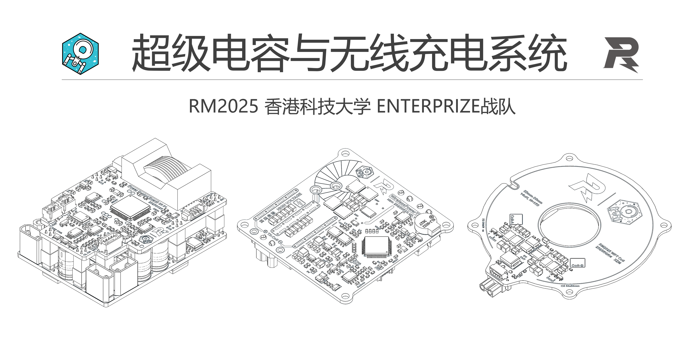
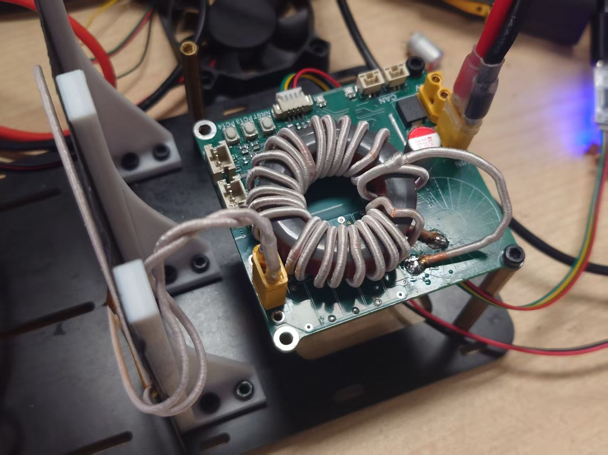

# RM2025-超级电容与无线充电系统开源
## 香港科技大学ENTERPRIZE战队

> 论坛链接：https://bbs.robomaster.com/article/761385?source=8

以下为复制论坛内容

大家好呀，RM2025的超级电容和无线充电的开源报告终于写完了，这套前前后后做了三四个月，最后在用在了所有上场的车上（无线充只有步兵和英雄有），场上没出过什么问题，很稳定。硬件上与上一代开源没有很大变动，主要的改动是超级电容换了**峰值电流内环**，然后与无线充电进行了融合，放到了一个MCU上去控。虽然有一些缺陷和不足但是总体效果还可以，希望可以帮到大家。如果大家有任何有疑问或者发现有问题的地方欢迎随时联系！

> 欢迎加入开源交流QQ群：581184202

发射端/功控板硬件、功控板代码：xzm
> 联系方式：微信 xianziming0531，邮箱 zxianaa@connect.ust.hk

发射端代码：zzy
> 联系方式：微信 baoqi-zhong，邮箱 zzhongas@connect.ust.hk

## 前言

因为峰值电流调试起来比较复杂，也比较麻烦，所以大家有需要还是建议优先参考我们24年/23年的开源，这两版电容都是可以保证稳定的，24年的开源基本上板子做出了烧个代码就能用了。

硬件上整体改动不大，也是分了上下板的设计，下板加了一个用来无线充电的数控Buck，MCU换成了G474，为了峰值电流改了采样电阻的位置，然后根据写23赛季开源的学长的建议改了一下实现上管常开的方式，具体的东西都写在开源报告里了。

整体上场的效果还是不错的，电容响应很快，无线充电功率传输和反向通讯表现也很稳定（可惜复活赛输太快了没在比赛时充），今后有机会也会补充更多资料。无线充效果展示可以看 https://bbs.robomaster.com/article/760961 里面的视频。

## 工程文件

使用 KiCAD 8.0设计，可以点击下面的链接用 kicanvas 在线预览。

功控板上板：[<u>**点击预览**</u>](https://kicanvas.org/?github=https%3A%2F%2Fgithub.com%2Fhkustenterprize%2FRM2025-PowerControlBoard-WirelessCharging%2Ftree%2Fmain%2FPowerControl_PCM_V0.1_Control)

功控板下板： [<u>**点击预览**</u>](https://kicanvas.org/?github=https%3A%2F%2Fgithub.com%2Fhkustenterprize%2FRM2025-PowerControlBoard-WirelessCharging%2Ftree%2Fmain%2FPowerControl_PCM_V0.1_Power )

无线充电发射端： [<u>**点击预览**</u>](https://kicanvas.org/?github=https%3A%2F%2Fgithub.com%2Fhkustenterprize%2FRM2025-PowerControlBoard-WirelessCharging%2Ftree%2Fmain%2FWirelessCharger_V0.1 )

无线充电接收端线圈： [<u>**点击预览**</u>](https://kicanvas.org/?github=https%3A%2F%2Fgithub.com%2Fhkustenterprize%2FRM2025-PowerControlBoard-WirelessCharging%2Ftree%2Fmain%2FPowerControlBoard_RXCoil_V0.1 )

## 开源报告

见“技术报告” 文件夹

[**技术报告 PDF**](https://github.com/hkustenterprize/RM2025-PowerControlBoard-WirelessCharging/blob/main/%E6%8A%80%E6%9C%AF%E6%8A%A5%E5%91%8A/RM2025%E8%B6%85%E7%BA%A7%E7%94%B5%E5%AE%B9%E4%B8%8E%E6%97%A0%E7%BA%BF%E5%85%85%E7%94%B5%E7%B3%BB%E7%BB%9F%E6%8A%80%E6%9C%AF%E6%8A%A5%E5%91%8A.pdf)

[**省流版 PDF**](https://github.com/hkustenterprize/RM2025-PowerControlBoard-WirelessCharging/blob/main/%E6%8A%80%E6%9C%AF%E6%8A%A5%E5%91%8A/%E7%9C%81%E6%B5%81%E7%89%88.pdf)

## 代码

功控板（超级电容+无线充电接收端）：待整理和测试，9月初整理过后的代码测好后开源

无线充电发射端：待整理，近期开源

## 相关开源
无线充电站机械结构：[ **【RM2025-无线充电站机械结构思路分享】香港科技大学ENTERPRIZE战队** ](https://bbs.robomaster.com/article/760961)

电容组：[**【RM2025-超小体积1980J电容组开源】香港科技大学ENTERPRIZE战队**](https://bbs.robomaster.com/article/760959)

## 复刻/已知问题/使用注意事项

1. 如果使用无线充电需要在功率控制板下板 无线充Buck的上管并联一个大功率肖特基二极管
2. 无线充电发射端的峰值检测二极管需要替换为肖特基二极管并联或其他快恢复二极管
3. 无线充电发射端的谐振电感需要自己绕，铁粉芯磁芯+利兹线
4. 使用手册和其他注意事项待完善，如遇问题欢迎随时联系

## 参考资料
1. 【RM2024超级电容控制器硬件+软件完全开源】 (史上最详细的开源！)香港科技大学ENTERPRIZE战队 https://bbs.robomaster.com/article/54127

2. 【RM2023-数控超级电容方案开源】香港科技大学-ENTERPRIZE战队 https://bbs.robomaster.com/article/9452

3. STM32 AN5306: Operational Amplifier (OPAMP) usage in STM32G4 Series

4. STM32 RM0440: STM32G4 series advanced Arm®-based 32-bit MCUs

5. STM32 AN5497: Introduction to the buck current mode with the B-G474E-DPOW1 Discovery kit（重要）

6. STM32 AN4539: HRTIM cookbook 

7. Qi Specification: Communications Physical Layer, Version 2.0 April 2023 

8. NXP AN4701: Demodulating Communication Signals of Qi-Compliant Low-Power Wireless Charger Using MC56F8006 DSC
STM32G474xB STM32G474xC STM32G474xE Datasheet 

## 致谢
感谢 ENTERPRIZE 战队硬件组学长 JYC RY OFR 为硬件部门打下的坚实基础，并在本赛季为超级电容与无线充电系统的设计调试中提供了巨大帮助

感谢 ENTERPRIZE 战队硬件组队员 ZZY 承担了大部分构建、调试发射端代码的工作

感谢机械组SJY帮忙画的保护外壳

感谢吉林大学、中国石油大学（华东）、华南理工大学在交流中分享的宝贵经验

非常感谢各位对香港科技大学 ENTERPRIZE 战队开源项目的关注与支持，若您在机器人设计过程中受益于我们的项目，恳请在开源引用中注明我们的项目来源。你们的支持是我们不断前行的动力。让我们携手共建一个鼓励创新、协作与超越的 RM 开源生态。

